# 🐝 BobSwarm — On-Demand Multi-Agent Orchestrator

> **IBM Bob 2.0 Hackathon Project**
> Transform any complex engineering task into a coordinated swarm of specialist agents — and get a unified answer in minutes.

---

## Preview

<p align="center">
  
</p>

## What is BobSwarm?

BobSwarm is an on-demand, multi-agent orchestrator built on IBM Bob 2.0. A developer describes a complex engineering task in plain language; Bob decomposes it, spawns specialised subagents that work **in parallel**, and aggregates their evidence into a single structured report.

It directly addresses the hackathon mandate: improve a multi-step developer workflow with Bob Agent mode, parallel tasks, subagents, and document understanding—not merely isolated code generation.

The proof of concept uses an explicit, honest operator handoff between its two product surfaces: the dashboard creates a tracked run and generates a copy-ready prompt; the user pastes that prompt into Bob, where native `spawn_subagent` execution begins. The dashboard observes the real MCP lifecycle and never claims that a browser request invoked Bob directly.

### Verified demo result

A committed frontend-linked session dispatched five specialists, published 59 live events, and completed with **41 literal-evidence findings across five roles in about 94 seconds**. The specialists' first findings overlapped within a 15-second window, demonstrating real concurrent work. See [`docs/bob-sessions/lethabo/CONTRIBUTIONS.md`](docs/bob-sessions/lethabo/CONTRIBUTIONS.md#session-6--live-dashboard-run-frontend-supplied-runid--2026-08-28).

---

## Team

| Role | Member | Key Focus |
|---|---|---|
| **Lead / Orchestrator** | Sibusiso | Master system prompt, end-to-end flow, Agent mode configuration |
| **Backend Engineer** | Lethabo | File system ops, Git integration, MCP server, background tasks |
| **Frontend Engineer** | Arisha | Web UI, real-time swarm visualisation, result display |
| **Data / QA Engineer** | Mmopiemang | Sample projects, test datasets, validation, demo script, Bobalytics |
| **AI/ML Engineer** | Farheen | Subagent persona design, prompt engineering, task decomposition logic |

---

## Repository Structure

```
BobSwarm/
├── .bob/
│   ├── custom_modes.yaml          # Bob mode: BobSwarm Orchestrator
│   └── skills/
│       └── bobswarm/
│           └── SKILL.md           # BobSwarm orchestration skill
│
├── orchestrator/
│   ├── system_prompt.md           # Master orchestrator system prompt (Sibusiso)
│   └── decompose.js               # Task decomposition logic (Farheen)
│
├── agents/
│   ├── debugger.md                # Debugger subagent persona (Farheen)
│   ├── documenter.md              # Documenter subagent persona (Farheen)
│   ├── refactorer.md              # Refactorer subagent persona (Farheen)
│   ├── onboarding.md              # Onboarding subagent persona (Farheen)
│   └── data_lineage.md            # Data Lineage subagent persona (Farheen)
│
├── mcp-server/
│   ├── package.json               # MCP server package (Lethabo)
│   ├── server.js                  # MCP server entry point (Lethabo)
│   └── tools/
│       ├── git.js                 # Git integration tools (Lethabo)
│       └── filesystem.js          # File system tools (Lethabo)
│
├── frontend/                       # React + TypeScript + Vite (Arisha)
│   ├── src/components/             # Nav, Hero/TaskForm, SwarmStage/RoleCard, ReportView
│   ├── src/hooks/useSwarmRun.ts    # Run lifecycle: dispatch, WS subscribe, live state
│   └── src/lib/                    # api.ts (REST/WS client), types.ts (shared contract)
│
├── demo/
│   ├── sample-project/            # Sample broken codebase for demo (Mmpoiemang)
│   │   ├── app.py
│   │   └── utils.py
│   ├── run_demo.sh                # Demo script (Mmpoiemang)
│   └── expected_output.md        # Expected swarm output for validation (Mmpoiemang)
│
└── docs/
    ├── architecture.md            # System architecture
    ├── agent_personas.md          # All agent persona specs
    └── CONTRIBUTING.md            # Team contribution guide
```

---


## How It Works

<p align="center">
  
</p>

---

## Supported Task Types

| Task | Subagents Spawned |
|---|---|
| **Debug a codebase** | Debugger, Data Lineage |
| **Document a project** | Documenter, Onboarding |
| **Refactor legacy code** | Refactorer, Debugger |
| **Onboard a new developer** | Onboarding, Documenter |
| **Trace data flow / lineage** | Data Lineage, Documenter |
| **Full engineering audit** | All 5 agents |

---

## Quick Start

### 1. Prerequisites
- IBM Bob 2.0 installed with a workspace open
- Node.js `^20.19.0` or `>=22.12.0`
- Python 3.10+ for the cross-platform demo validator

### 2. Install dependencies and register the MCP server

```bash
npm --prefix mcp-server ci
npm --prefix frontend ci
```

The BobSwarm mode and skill are committed under `.bob/`. Copy
`.bob/mcp.json.example` to `.bob/mcp.json`, replace the placeholder `cwd` with
the absolute path to this clone, then reopen the workspace in Bob. The MCP panel
must show `bobswarm` as connected before a live run.

### 3. Start the two local services

In separate terminals:

```bash
npm --prefix mcp-server start
npm --prefix frontend run dev
```

Open `http://localhost:5173`. The events bridge binds to
`http://127.0.0.1:8787` by default.

### 4. Run the golden path

1. Submit the task in the dashboard.
2. Copy the generated **Bob handoff prompt**, which contains the full run UUID.
3. Switch to **BobSwarm Orchestrator** mode in Bob and paste the prompt.
4. Watch real specialist progress, evidence, and the final report in the dashboard.

Suggested task:

> _"Analyse this codebase, find all bugs, document the public API, and give me an onboarding guide for a new developer."_

### 5. Verify the complete repository

```bash
npm run verify
```

This runs the orchestrator assertions, demo-fixture checks, Python regressions,
backend lifecycle/WebSocket/security tests, frontend lint/tests, and production
build. If Python is not on `PATH`, set `BOBSWARM_PYTHON` to its executable.

Windows users can run `demo/run_demo.ps1`; macOS, Linux, and Git Bash users can
run `demo/run_demo.sh` for the guided demo preflight.

---

## Built On

- **IBM Bob 2.0** — Agent mode, `spawn_subagent`, parallel tasks, skills, custom modes
- **MCP (Model Context Protocol)** — Git, filesystem, and swarm-lifecycle tool exposure

Everything in this repository was built during the Contest window. The
multi-agent execution is IBM Bob's own Agent mode and `spawn_subagent` — see
[`docs/CRITICAL_DECISIONS.md`](docs/CRITICAL_DECISIONS.md) for why this repo
does not depend on any pre-existing codebase.

---

## Hackathon Alignment

| Judging Criterion | How BobSwarm addresses it |
|---|---|
| **Completeness and feasibility** | Bob custom mode + skill, five personas, MCP tools, strict run lifecycle, event recovery, deterministic report, one-command verification |
| **Creativity and innovation** | Makes Bob's specialist parallelism observable and requires literal evidence before a finding enters the report |
| **Design and usability** | Polished task form, copy-ready Bob handoff, live role cards, timeline, recovery, history, and evidence-first report |
| **Effectiveness and efficiency** | Recorded five-role run: 41 evidence-backed findings, 59 events, about 94 seconds, visibly overlapping specialist work |

Copy-ready submission text, the video storyboard, claims discipline, and final
gates are in [`docs/SUBMISSION_PACKAGE.md`](docs/SUBMISSION_PACKAGE.md).
